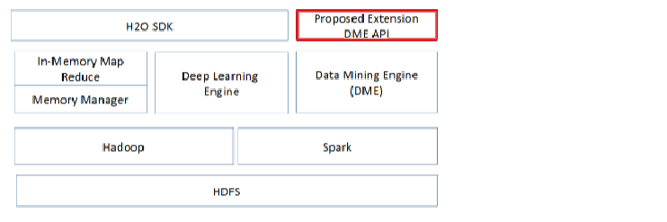

# Data Mining Library for Sparkling Water Platform

__AUTHOR: ELİF CANSU YILDIZ__

[TOC]

## Sparkling Water Platform

Sparkling Water is an integration of H2O into the Spark ecosystem. It facilitates the use of H2O algorithms in Spark workflows. It is designed as a regular Spark application and provides a way to start H2O services
on each node of a Spark cluster and access data stored in data structures of Spark and H2O. [1]

## Proposed Extension Data Mining Engine API




## Dependencies

- Linux/OS X/Windows
- Java 1.8+
- Python 2.7+ For Python version of Sparkling Water (PySparkling)

- Sparkling Water  (Follow [this link](http://docs.h2o.ai/sparkling-water/2.4/latest-stable/doc/pysparkling.html#pysparkling))

- Spark and `SPARK_HOME` shell variable must point to your local Spark installation

- H2O

- Hadoop  


## How to Run

- Activate Hadoop

  ```
  $ start-all.sh
  ```

  See which ports active

  ```
  $ jps
  ```

  Should be seen `DataNode`, `ResourceManager`, `NameNode`, `SecondaryNameNode`, `NodeManager` ports are active

  __NOTE:__ HDFS interface can be accessed from __localhost:50070__

- Activate Spark from `$SPARK_HOME/sbin` directory

  ```
  $ ./start-all.sh
  ```

  `Master` and `Slave` nodes are activated

  __NOTE:__ Spark interface can be accessed from __localhost:8080__

- Run the __BIGDATAPROJE.jar__ in `/dist` directory. 

  ```
  $ java -jar BIGDATAPROJE.jar
  ```

- Algorithms can be run from GUI.

  

- In the end stop the Spark and Hadoop.

  Stop Spark from `$SPARK_HOME/sbin`:

  ```
  $ ./stop-all.sh
  ```

  Stop Hadoop: (from any directory)

  ```
  $ stop-all.sh
  ```


## Notebooks

There is also ipython notebooks generated for each algorithms implemented in Sparkling Water platform.

| Data Mining Steps   | Algorithm                    | Notebook                  | Description                                                  |
| ------------------- | :--------------------------- | :------------------------ | ------------------------------------------------------------ |
| Outliers Analysis   | Mahalanobis Distance         | [Mahalanobis](xx)         | Implement mahalanobis distance in Sparkling Water.           |
| Imputing            | Linear Regression            | [linear-regression](xx)   | Implement linear regression in Sparkling Water.              |
| Imputing            | Multiple Imputation          | [multiple-imputation](xx) | Implement multiple imputation in Sparkling Water.            |
| Dimension Reduction | Principal Component Analysis | [pca](xx)                 | Implement PCA in Sparkling Water.                            |
| Feature Selection   | Information Gain             | [information-gain](xx)    | Implement information gain algorithm in Sparkling Water.     |
| Classification      | Logistic Regression          | [logistic-regression](xx) | Implement logistic regression in Sparkling Water.            |
| Clustering          | K-Means                      | [k-means](xx)             | Implement K-Means in Sparkling Water.                        |
| vfvdevfde           | FP-Growth                    | [fp-growth](xx)           | Implement FP-Growth in Sparkling Water.                      |
| Ensemble Learning   | Stacking                     | [stacking](xx)            | Implement Stacking that includes Random Forest and Gradient Boosting inside in Sparkling Water |

## Citation

If you use this implementation in your work, please cite the following:

E. Cansu Yıldız, M. S. Aktas, O. Kalıpsız, A. N. Kanlı and U. O. Turgut,
"Data Mining Library for Big Data Processing Platforms: A Case 
Study-Sparkling Water Platform," *2018 3rd International Conference on Computer Science and Engineering (UBMK)*, Sarajevo, 2018, pp. 167-172.
doi: 10.1109/UBMK.2018.8566278     [view](URL: <http://ieeexplore.ieee.org/stamp/stamp.jsp?tp=&arnumber=8566278&isnumber=8566244>)

## References

[1] http://docs.h2o.ai/sparkling-water/2.4/latest-stable/doc/pysparkling.html#what-is-sparkling-water

